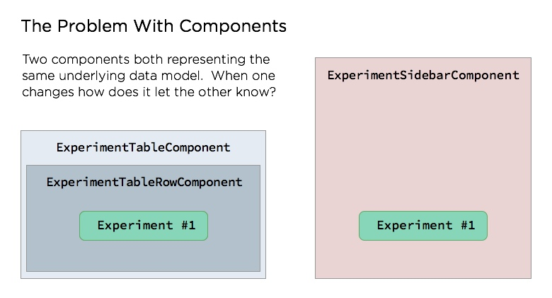
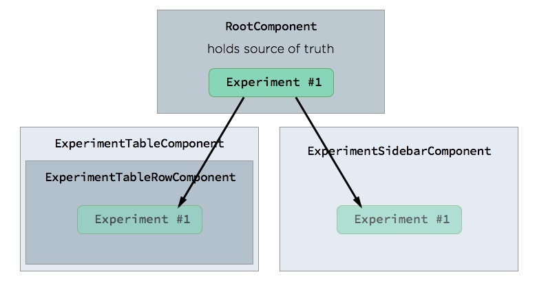
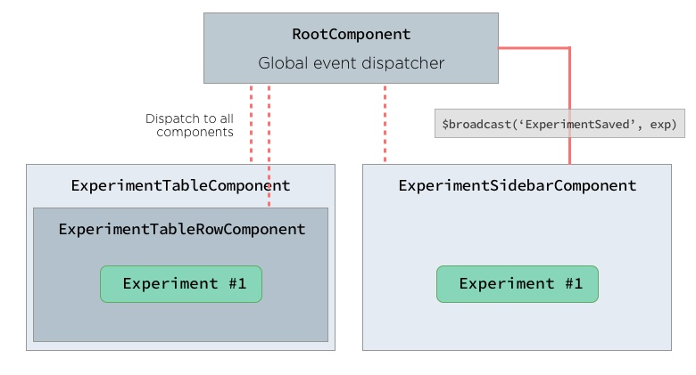

====

- intro
  * show you how we went from a mess of spaghetti jquery code with some knockout layered on top to a completely componentized
    frontend with stateless components and E2E testing

- history of optimizelys frontend
  * Mix of jQuery code + knockout
  * the problem with knockout - not reusable / one page per VM / support legacy browserso

- our solution part 1: VueJS
  * small UI component framework, similar to knockout VM and angular js markup
  * but there was a problem: "The more portable and reusable UI components became the harder it was to keep them in sync and share data"
  * show example code of a VueJS view model and corresponding component markup

- Attempted solutions
  * Parent or root UI component manages state for the application (picture)
  * using events (picture)

-

====

# Stateless UIs with Flux + VueJS

You are about to learn one codebase's transformative journey from jQuery spaghetti code to one of UI components, Flux architecture, and completely
stateless UI.

But before we start, what is a stateless UI?  While there doesn't exist a 100% formal definition, here at Optimizely we'd consider anything that
meets the following criteria a "Stateless UI".

1.  UI components do not manage their own state or data.

2.  A completely separate system manages state and data flow.  This system should be able to run and function with no UI present.  This allows
the ability to test your application logic and even UI logic without having a UI present.  NodeJS testing anyone?

3.  Application can be put into any state or reset completely and the UI reacts appropriately.


##  A brief history of Optimizely's frontend stack

Rewind to early 2014, jQuery and DOM selectors everywhere, everything was an object and had to be instantiated and the whole system had an immense
amount of state at runtime.

To paint a better picture, imagine you are a new developer first looking into a codebase and you run into the following function.

```js
optly.conditions.ConditionPicker.prototype.setValues = function() {
  this.context.find(".condition-visitor-type").val(/** @type {string} */ (this.data.visitorType));

  this.initializeQueryParamMatches(this.data.queryParamNames,
                                   this.data.queryParamValues);
  this.initializeExcludeQueryParamMatches(this.data.excludeQueryParamNames,
                                          this.data.excludeQueryParamValues);
  this.initializeInputArray(this.data.browserMatches,
                            goog.bind(this.addBrowserInput, this),
                            ".condition-browsers",
                            ".condition-browser-match");
  this.initializeInputArray(this.data.excludeBrowserMatches,
                            goog.bind(this.addExcludeBrowserInput, this),
                            ".condition-exclude-browsers",
                            ".condition-exclude-browser-match");
  this.initializeInputArray(this.data.languageMatches,
                            goog.bind(this.addLanguageInput, this),
                            ".condition-languages",
                            ".condition-language-match");
  this.initializeInputArray(this.data.excludeLanguageMatches,
                            goog.bind(this.addExcludeLanguageInput, this),
                            ".condition-exclude-languages",
                            ".condition-exclude-language-match");
  this.initializeCookieMatches(this.data.cookieNames,
                               this.data.cookieValues);

// the function goes on for 30 more lines
```

What does it do?  What values is it setting or what do these CSS selectors do?  Without context, and a lot of it, its impossible to understand what this code
is doing and how you would go about changing it to add functionality.  

Having worked in a codebase that was recently refactored I identified the following shortcomings:

- Knockout's one view model per page philosophy lead to copy / pasting code everywhere.
- Business logic and UI logic conflated in "components"
- Object instantiation pyramids - in order to figure out context you'd have to go all the way up the pyramid

## Solution: Components to the Rescue

Our requirements for a new framework were pretty ideal.  Something we could incrementally implement, does not need to support < IE 10 and lastly a design that encouraged
the decoupling of business logic and UI views.  After investigating several other candidates, including AngularJS, we found the very single-purposed component UI framework [VueJS](http://vuejs.org). 

How did it live up to our checklist of requirements:

1.  Incremental implementation - VueJS is light (14kb gzip+minified) and its components can be attached to the DOM disparately.  Our first component we ever wrote was the Navbar.

2.  Decoupling of business logic and UI views - VueJS is only concerned with UI components and doesn't really have any opinions about data fetching and syncing, allowing us to 
implement our business logic in "services".

3.  No need for legacy browser support - VueJS is takes full advantage of ES5 getters / setters to provide a much simpler API.  Contrast that to KnockoutJS

**The Very First Component: Navbar**

```js
define(function(require) {
  var _                 = require('lodash');
  var app               = require('app');
  var enums             = require('utils/enums');
  var auth              = require('services/auth');
  var router            = require('services/router');

  var getAccount = require('flux/getters/account');

  return {
    data: {
      account: null,
      activeProjects: [],
      experimentsMessage: '',
      /**
       * @var {Array.<{
       *  id: <number>,
       *  can_edit: <boolean>,
       *  description: <string>,
       *  has_started: <boolean>
       * }>}
       */
      experiments: [],
    },
    computed: {
      dashboardLink: function() {
        if (this.currentProjectId) {
          return router.dashboardTab(this.currentProjectId);
        }
        return router.dashboard();
      },
      /**
       * Determines whether the currently active account has an active web projects.
       * @returns {boolean}
       */
      hasActiveWebProject: function() {
        var filteredProjects = _.filter(this.activeProjects, function(project) {
          // An empty project_platforms list we treat as a web project (it just hasn't been migrated yet)
          return (
            project.project_platforms.length === 0 ||
            project.project_platforms.indexOf(enums.ProjectPlatformType.WEB) !== -1
          )
        });
        return filteredProjects.length > 0;
      },
      showSignInLink: function() {
        return window.location.pathname() !== router.signIn();
      },
      showDashboardLink: function() {
        return !this._isOnboarding() && window.location.pathname() !== router.dashboard();
      },
      isNewDashboard: function() {
        return window.location.pathname().indexOf('projects') !== -1;
      },
      showExperimentsDropdown: function() {
        return !this._isOnboarding() && !this.isNewDashboard;
      }
    },
    methods: {
      // expose logout functionality
      logout: auth.logout,
      /**
       * Takes an experiment and returns the edit url
       */
      editUrl: function(experiment) {
        return router.experimentEdit({
          experimentId: experiment.id
        });
      },
      dashboardUrl: function(account){
        return router.dashboard()
      },
      /**
       * Shows the dialogs/get-feedback component.
       */
      showGetFeedbackDialog: function() {
        var config = {
          component: 'dialogs/get-feedback'
        };
        app.$broadcast('showDialog', config);
      },
    },
    ready: function() {
      if (this.account.isSignedIn) {
        this._loadExperiments();
      }
      // Copy and modify the activeProjects property of optly/account.js so that we can keep track of
      // artice projects in this component.
      this.activeProjects = _.map(_.keys(this.account.activeProjects), (function(project_id) {
        return {
          id: project_id,
          project_platforms: this.account.activeProjects[project_id].project_platforms
        }
      }).bind(this));

      // whenever account info changes reload experiments
      this.$watch('account', function(account) {
        if (flux.store('account').isSignedIn()) {
          this._loadExperiments();
        }
      });
      // when an experiment is saved update recent experiments
      this.$on('experimentSaved', this._loadExperiments);
      // when a project is archived
      this.$on('activeProjectsChanged', this._handleActiveProjectsChanged.bind(this));
    },
  }
})
```

And the corresponding HTML template

```html
<ul class="nav-top signed-out" v-show="!account.isSignedIn">
  <li><a class="show-create-account">Sign Up</a></li>
  <li><a id="show-sign-in" class="show-sign-in" v-show="showSignInLink">Log In</a></li>
</ul>
<ul class="nav-top signed-in" v-show="account.isSignedIn" v-cloak>
  <li id="dashboard-link">
    <a v-attr="href: dashboardLink">Home</a>
  </li>
  <li>
    <a href="https://help.optimizely.com" target="_blank" id="optimizely_2635985_kb">Support</a>
  </li>
  <li id="resources-menu" class="dropdown" v-dropdown>
    <a href="javascript:void(0)" id="show-resources-menu" class="dropdown-arrow" data-show-dropdown>
      Resources
    </a>
    <ul class="dropdown-menu-top">
      <li><a href="http://www.optiverse.com/" target="_blank">Optiverse</a></li>
      <li><a href="/pricing" target="_blank">Pricing</a></li>
      <li><a href="/partners/solutions/" target="_blank">Solutions Partners</a></li>
      <li><a href="/partners/technology/" target="_blank">Technology Partners</a></li>
      <li><a href="http://developers.optimizely.com/" target="_blank">Developer Platform</a></li>
      <li><a href="/resources/sample-size-calculator/" target="_blank">Sample Size Calculator</a></li>
      <li><a href="http://blog.optimizely.com/" target="_blank">Blog</a></li>
      <li><a href="/resources" target="_blank">More Resources</a></li>
    </ul>
  </li>
  <li id="getfeedback-link">
    <a href="javascript:void(0)" id="show-get-feedback-link" v-on="click: showGetFeedbackDialog" >
      Feedback
      
    </a>
  </li>
  <li id="my-account-menu" class="dropdown dropdown-top" v-dropdown>
    <a href="javascript:void(0)" class="account-menu-username dropdown-arrow" v-class="is-admin: account.isAdmin" data-show-dropdown>
      [[ account.email ]]
    </a>
    <div v-component="account-switcher"></div>
  </li>
</ul>
```

Now we have the tools to create small reusable UI components.  Quickly our library of a few components became dozens as, everyday,
more and more developers started writing Vue components. Things were great, we were able to reuse the same UI elements on different pages
and a new developer could easily look at a single component have a pretty good understanding of what it does, without having context on
where it was used.

This new component architecture had many great benefits but one particular aspect became a very hard problem to solve.

> The more portable and reusable UI components became the harder it was to keep them in sync and share state.



By making UI elements more reusable we are required to draw stricter boundaries between the component insides and the page context,
making it naturally harder to share state between components. As we started refactoring more and more of our UI to components this
problem became more and more prevalent. 

## What We Tried

### 1. Parent or root component manage state shared by child components.

By referencing the same objects, components will stay in sync...always.  This solution worked, but had many drawbacks.  For instance, it was very
tedious to set up a component that was able to make changes to the underlying object only after a user hit save, there was no notion of a local copy.

Secondly, where the objects true parent or source of truth was the common ancestor of whatever components needed this data.  If another component on
the page needs access to this object that it would have to be a descendent of the objects root component or the objects root component would have to change
to accomodate this new data need.



### 2.  Communicating with Events

Another solution is to use VueJS's event system to communicate changes in shared state.  If a component is writing to the canonical representation of
data model, than it can `$broadcast` an event and any component that needs to react to changes can listen.  In theory this works pretty well, while in
practice is became very tedious, fragile and unpredictable.

In our **ExperimentSidebarComponent** we would have the following function.

```js
{
  saveExperiment: function(experiment) {
    ExperimentModel.save(experiment).then(function(exp) {
      this.$broadcast('ExperimentSaved', exp)
    }.bind(this))
  }
}
```

And in **ExperimentTableRowComponent**

```js
{
  created: function() {
    this.$on('ExperimentSaved', this.updateExperiment)
  }
}
```

This becomes a lot of boilerplate very quickly, as well as not having good conventions around the pub / sub.  However, the biggest shortcoming to this approach was
the unpredictability and difficulty to easily understand the data flow.  There is no single place that enumerates which components broadcast what and which components
are listening to these events.  This problem is magnified because of the two-way communication that is occuring here, which is not ideal for a pub/sub system.



## The Solution: Flux To The Rescue!
